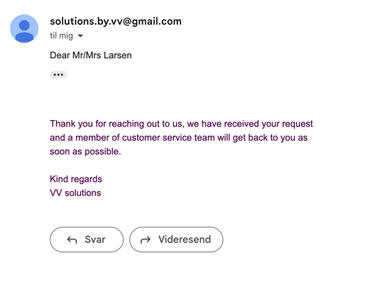
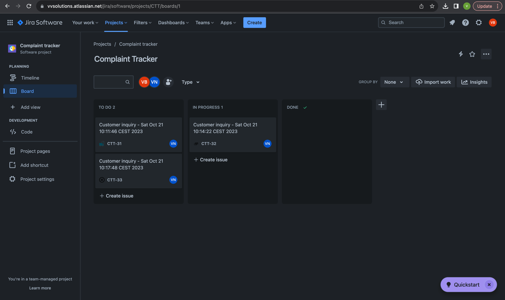
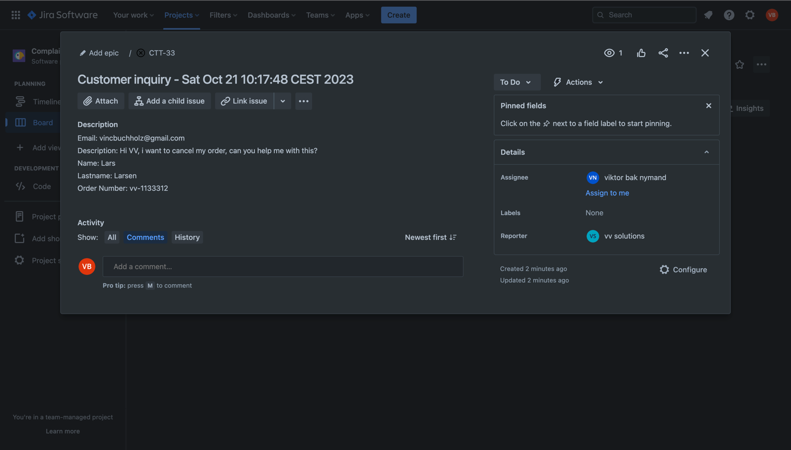
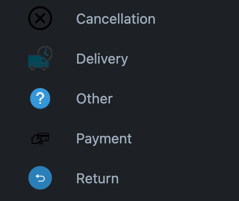

# customer-complaint-svc

This project uses Quarkus, the Supersonic Subatomic Java Framework, and Apache Camel

## Description

This project serves as Message oriented middleware, between a complaint frontend, Jira and Email.

The project consumes json data through a REST endpoint(described below), sends A mail to the customer
to inform them that their request is received, and creates a new JIRA. 

## Running the application in dev mode

##### This project requires a bit of setup, if you just want a demo, come ask Viktor and Vincent.

To run this project you need to setup a gmail account with an application password and set the following environment variables:

- QUARKUS_MAILER_FROM=(your created email)
- QUARKUS_MAILER_HOST=smtp.gmail.com
- QUARKUS_MAILER_PORT=465
- QUARKUS_MAILER_SSL=true
- QUARKUS_MAILER_USERNAME=(your created email)
- QUARKUS_MAILER_PASSWORD=(your created application password)
- QUARKUS_MAILER_MOCK=(false)

documentation = https://quarkus.io/guides/mailer-reference#gmail-specific-configuration

Furthermore, you need to set up a JIRA account and set the following environment variables:

- JIRA_PASSWORD=(access token)
- JIRA_USERNAME=(email)
- JIRA_URL=(url to your JIRA application)

documentation = https://camel.apache.org/components/4.0.x/jira-component.html

This application exposes one endpoint which can be called via swagger(swagger can be found via http://localhost:8080/q/swagger-ui/, when running the application in dev mode) or any tool you like

- init endpoint (POST) = http://localhost:8080/api/complaint
    - consumes JSON with the following structure
  ```json
    {
      "category": Integer,
      "description": String,
      "email": String,
      "name": String,
      "lastname": String,
      "orderNumber": String
    }
  ```
    - successful response = 200 (this will send a mail to the email address' provided and create a jira with the information's provided)


You can run your this application in dev mode using:
```shell script
./mvnw compile quarkus:dev
```

### DEMO

#### Mail Received:


### The Jira Board:


### A Jira Task:




### Issue types:

